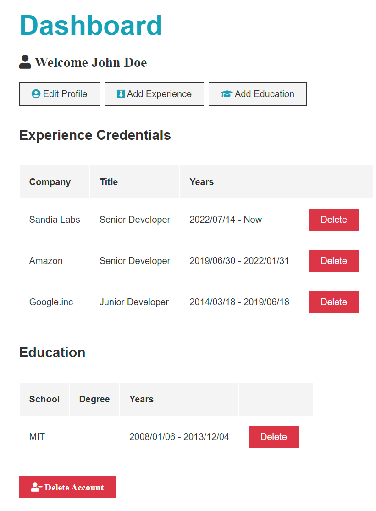

# [Traversy Media MERN Course](https://www.udemy.com/course/mern-stack-front-to-back/)

## Full Stack Web Application

## LEARNING | [Udemy Course](https://www.udemy.com/course/mern-stack-front-to-back/)

## Purpose

This application was created by [Brad Traversy](https://www.udemy.com/user/brad-traversy/). I completed this course to further my understanding of a MERN Full Stack Web Application.

**_ UPDATE _**

This is the frontend portion of this [project](https://github.com/D-Whipp/mern-stack-bt). I've separated the frontend from the backend due to an employment method I've found.

## Technologies Used

- JavaScript
- React
- Moment
- Express
- MongoDB
- Mongoose
- Nodemon
- BCryptjs
- Gravatar

## About

Hello, my name is David. \
You can email me at dwhipp88@gmail.com. \
You can view my [github](https://github.com/D-Whipp). \
My portfolio is currently under construction. I'll link it here once I have it up and running again.

## Badges

